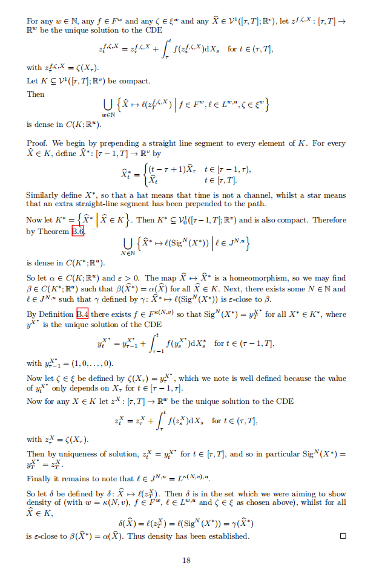
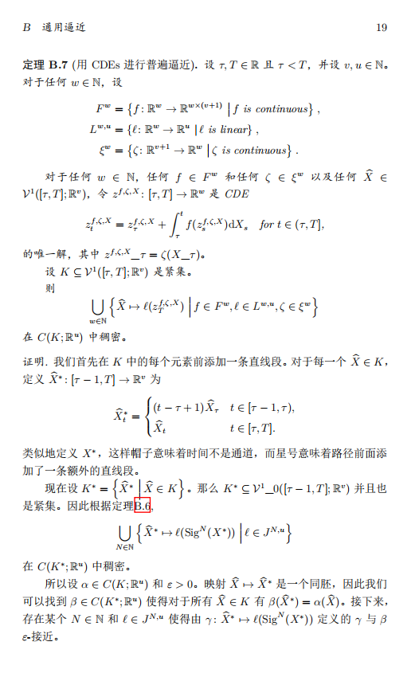

# TransTeX 📚  
  
**Smart LaTeX Translation Powered by LLMs — Preserve Structure, Translate Content**

[](LICENSE)  []()  []()

TransTeX leverages Large Language Models (LLMs) to translate LaTeX documents **without breaking compilation**. It intelligently protects LaTeX commands, math formulas, citations, and environments — so your translated paper compiles just like the original.

> ✅ **Over 90% of real-world LaTeX projects translate and compile successfully on the first try.**

---

## 🌐 Language Versions

- [English (this page)](README.md)
- [简体中文](README_zh.md)

---

## ✨ Key Features

### 🧠 Smart Translation Engine
- **Structure-aware parsing**: Only translatable text is sent to the LLM; all LaTeX syntax is preserved.
- **Math-safe**: `$...$`, `$$...$$`, `\begin{equation}`, `\cite{}`, `\ref{}`, `\label{}` are never altered.
- **Environment-aware**: Standard environments (`figure`, `table`, `theorem`, `itemize`, etc.) are respected.

### ⚙️ Industrial-Grade Compilation Pipeline
- **Adaptive XeLaTeX compilation**: Automatically runs 2–5 passes until `.aux` file converges (layout stable).
- **BibTeX/Biber auto-detection**: Handles both classic BibTeX and `biblatex`.
- **Non-critical cache cleanup**: Removes `.log`, `.toc`, `.aux.bak`, etc., before each build for reproducibility.

### 📤 Dual-Path DOCX Export (Optional)
1. **Primary**: Pandoc (`.tex` → `.docx`) with auto-generated compatibility layer for custom commands (e.g., `\naturals`, `\ts`).
2. **Fallback**: PDF → DOCX via:
   - **LibreOffice** (high-fidelity, if installed)
   - **`pdf2docx`** (pure Python, always available)

> 💡 Ensures **a Word document is always produced**, even in minimal environments.

### 🌐 Flexible LLM Backend Support
| Backend | Config Name | Notes |
|--------|-------------|------|
| OpenAI | `openai` | Official API |
| Alibaba Cloud | `aliyun` | DashScope + optional web search |
| Generic OpenAI-compatible | `generic` | Supports **Tencent HunYuan**, **Volcano Engine**, **Azure OpenAI**, **local models**, etc. |

All backends support:
- Parallel translation with concurrency control  
- Configurable `temperature`, `top_p`, `max_tokens`  
- API keys via environment variables (`LLM_API_KEY`)

### 📁 Project Modes
- **`arxiv`**: Translate papers by URL (auto-download + unpack)
- **`single`**: Single `.tex` file
- **`project`**: Full directory with `.bib`, `.cls`, subfiles, etc.

---

## 📸 Example

| Original (English) | Translated (Chinese) |
|--------------------|----------------------|
|  |  |
> **A complete comparison of translation results can be viewed in the [sample TeX data](demo) and [sample output results](output).**

---

## 🚀 Quick Start

```bash
git clone https://github.com/baojiachen0214/LaTeXTranslator.git
```
```bash
pip install -r requirements.txt
```
```bash
python -m trans --config config.yaml
```

---

## ⚙️ Sample Config (`config.yaml`)

```yaml
# ======== General settings ========
# Project name (optional, for identifying the project)
# When specified, results will be saved in a timestamped subdirectory under output.dir
project_name: "MyLaTeXProject"
mode: "project"  # arxiv | single | project

# ======== Input settings ========
input:
  url: "https://arxiv.org/..."        # arxiv URL or local path
  path: "./demo/document.tex"         # for mode=single
  dir: "./demo/demo_project"          # for mode=project

# ======== Output settings ========
output:
  dir: "./my_output"
  compile: true

# ======== Translation settings ========
translation:
  target_lang: "Chinese"
  chunk_size: 3800
  use_cot: false
  fix_hyphen: true
  fix_command_adhesion: true

# ===== LLM settings ===
llm:
  backend: "openai"
  model: "gpt-4o-mini"
  api_key: <-- replace with your own api key -->
  base_url: "https://api.openai.com/v1/"
  temperature: 0.1
  top_p: 0.9
  max_concurrent: 15
  max_retries: 3

# ======== Prompt settings =======
prompts:
  system: "You are a professional LaTeX translator."
  user: "Translate the following LaTeX content to {target_lang}..."
```

---

## ⚠️ Known Limitations

- **Custom environments** (e.g., user-defined `\begin{proof}...\end{proof}`) may be partially translated.  
  → *Workaround: Wrap in `\begin{verbatim}...\end{verbatim}` or avoid translating them.*
- Extremely complex TikZ or nested tables may require manual adjustment.

> 🔒 **Your original files are never modified.** All operations are non-destructive.

---

## 📄 License

MIT © [Jiachen Bao]. See [LICENSE](LICENSE).